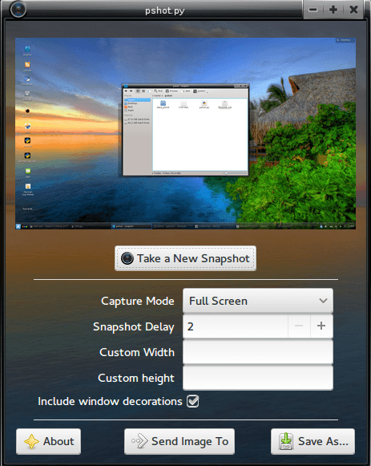
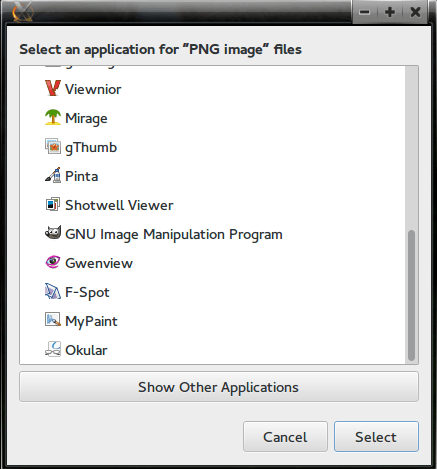

pshot
=====
 
Screenshot Utility written in python

Modes: Full Screen, Active Window, Custom width & height

Send Image To clicked, so far it supports up to 21 different image viewers and editors.
 

## Archlinux support
Archlinux users can install the program directly from AUR, without the need to download it from here.

    yaourt -S pshot-git

## Requirements

* imlib2
* imagemagick
* python2
* python2-gobject
* webkitgtk
* pywebkitgtk